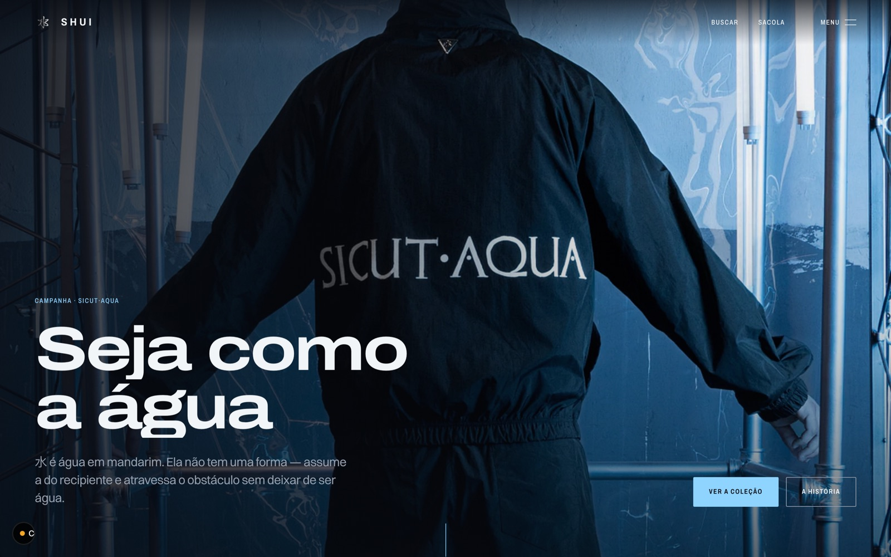

<div align="center">

# cannonball

**Você não começa do zero. Você já chega com impulso.**

Plugin do Claude Code que guarda as peças de site que você já fez — e as encontra
de volta, antes de qualquer coisa ser gerada outra vez.


</div>

<br>

[](exemplo/)

<div align="center">
<sub><b>Acima:</b> uma loja de 81 produtos e 99 páginas, montada de três peças do
acervo. <a href="exemplo/">O caso completo, com os quatro bugs que a montagem
achou →</a></sub>
</div>

<br>

O acervo é **seu**, e começa quase vazio: vêm três peças de exemplo e mais nada.
Você alimenta com o que já tem — prompt, componente, efeito, design system, projeto
inteiro — e a partir daí as skills decidem a partir do que existe ali dentro, não de
uma lista fixa escrita por outra pessoa.

Nenhuma skill carrega número fixo. Todas leem o acervo na hora, então o mesmo motor
serve quem tem três peças e quem tem mil — e fica melhor a cada uma que entra.

## O ciclo

```
ingerir  →  indexar  →  buscar  →  montar  →  registrar armadilha  →  ingerir…
```

Cada volta o acervo fica melhor, e as skills junto com ele. Não há número fixo em
lugar nenhum: toda skill lê o acervo na hora.

```bash
python scripts/perfil.py
```

É o retrato de agora — famílias, setores, stacks, cobertura por função, **lacunas**,
armadilhas registradas e os avisos de saúde. Toda skill começa por aí.

## Instalar

Requisito único: **Python 3**. Os scripts importam só a biblioteca padrão — sem
`pip install`, sem `node_modules`, sem rede.

### Claude Code

```bash
git clone https://github.com/harebeats/cannonball.git
cd cannonball
claude plugin marketplace add .
claude plugin install cannonball@cannonball
```

### Codex, Gemini CLI, Cursor e os outros

A CLI do [Agent Skills](https://agentskills.io) instala nos agentes que encontrar:

```bash
npx skills add harebeats/cannonball -g
```

`-g` instala para o seu usuário (`~/.codex/skills`, `~/.gemini/skills`,
`~/.agents/skills`…); sem ele, instala no projeto atual. Para mirar um só:

```bash
npx skills add harebeats/cannonball -g -a codex
npx skills add harebeats/cannonball -g -a gemini
npx skills list harebeats/cannonball        # ver as 9 antes de instalar
```

**Cada pasta em `skills/` é autocontida** — carrega o `SKILL.md`, o `scripts/` que ele
chama, o `references/` que cita e o `seed/`. Você pode instalar as nove ou só a que
interessa: `kit-cor` e `kit-tipo`, por exemplo, resolvem paleta e licença de fonte sem
depender de acervo nenhum.

### Manual, em qualquer agente

```bash
git clone https://github.com/harebeats/cannonball.git
ln -s "$(pwd)/cannonball/skills/kit-buscar" ~/.agents/skills/kit-buscar
```

O símbolo mantém a instalação em dia com o seu clone. Serve para `~/.codex/skills`,
`~/.gemini/skills`, `~/.cursor/skills` — a pasta muda, o resto não.

> **Por que funciona igual em todos.** Nenhum `SKILL.md` usa variável de ambiente de
> agente. Cada um resolve os próprios scripts a partir da pasta de onde foi lido, o
> que é informação que todo harness dá. Ver [AGENTS.md](AGENTS.md).

O acervo é criado em `~/.cannonball` na primeira vez que uma skill roda, já com as
três peças de exemplo dentro.

### O que vem na caixa

Três componentes originais, e eles existem tanto para a primeira busca devolver
alguma coisa quanto para servir de **modelo de ficha bem escrita**:

| Peça | O que resolve |
|---|---|
| `kit-agendamento` | serviço → data/hora → contato, com expediente, duração e antecedência como configuração |
| `kit-calendario` | seleção de data com teclado, idioma via `Intl`, disponibilidade por predicado |
| `kit-mapa` | localização sem chave de API, na paleta do site por filtro CSS |

Vêm com **11 armadilhas registradas** — sobreposição de horário que dobra a agenda,
`new Date()` durante a renderização quebrando hidratação entre servidor UTC e
visitante UTC−3, iframe de mapa roubando o scroll da página. Busque por
`agendamento` e leia: é o formato que o resto do acervo deve seguir.

Nenhuma tem dependência npm nem asset externo. Toda a aparência sai de variável CSS
(`--kit-*`, com fallback nos tokens do site e, por último, `currentColor`), e texto e
regra de negócio saem de prop. **Trocar de cliente é trocar configuração.**

São suas depois de copiadas: edite, melhore ou apague. Nada volta a sobrescrever.


### Vincule a sua pasta — é o primeiro passo, e o mais fácil de esquecer

Sem isso o acervo nasce em `~/.cannonball`, que serve para experimentar mas quase
nunca é onde você quer o material a longo prazo. **Faça antes de ingerir qualquer
coisa** — depois é mover pasta na mão.

```bash
python scripts/vincular.py --para ~/meu-acervo
```

O ponteiro é gravado em `~/.cannonball/aonde`, **fora do plugin**. Isso importa: o
plugin instalado é uma cópia em cache que a próxima atualização apaga, então qualquer
configuração gravada dentro dele se perde em silêncio.

```bash
python scripts/vincular.py                    # onde está agora, e quem está mandando
python scripts/vincular.py --para <pasta> --mover   # leva junto o que já tem
python scripts/vincular.py --soltar           # volta para o padrão
```

Se preferir variável de ambiente, ela vence o ponteiro:
`export CANNONBALL_ACERVO="/caminho/para/o/acervo"`.

Aponte para uma pasta versionada num repositório **privado** seu: o acervo é material
seu e de terceiros, e não é para redistribuir.

## Por onde começar

O plugin não impõe ordem — as skills disparam sozinhas quando o assunto aparece. Mas
existe uma sequência que dá resultado muito melhor, e ela sai adaptada ao estado do
seu acervo em:

```bash
python scripts/perfil.py
```

**Uma vez, ao instalar:**

| | | |
|---|---|---|
| 1 | `vincular.py --para <pasta>` | diga qual pasta é o seu acervo |
| 2 | **`/kit-ingerir`** | encha com o que você já tem — arquivo, texto colado, projeto inteiro, registro shadcn |
| 3 | **`/kit-curar`** | depois da primeira leva grande: acha ficha fraca, que é peça invisível para a busca |

**Em cada projeto novo:**

| | | |
|---|---|---|
| 1 | **`/kit-buscar`** | o que eu já tenho pra isso? Dispara sozinha antes de construir |
| 2 | **`/kit-cor`** | decida a cor **antes** de escolher o design system |
| 3 | **`/kit-tipo`** | confira a licença **antes** de adotar a fonte |
| 4 | **`/kit-montar`** | pergunta a stack e o **tipo de hero**, e monta |
| 5 | **`/kit-otimizar-3d`** | se tem WebGL, antes de entregar |
| 6 | **`/kit-ingerir`** | guarde o que deu certo e registre a armadilha |

A ordem de 2 e 3 não é preciosismo: escolher o design system primeiro faz a cor e a
fonte virem de brinde, e é exatamente assim que se chega no automático — e como se
descobre na entrega que a fonte é paga.

O passo 6 é o que fecha o ciclo. Sem ele o plugin é uma biblioteca parada; com ele,
cada projeto deixa o próximo mais rápido.

## As duas que trabalham com prompt

Nem todo trabalho termina em código escrito aqui. Metade do que circula em web design
hoje é **prompt** — o brief que você leva ao v0, o texto que alguém te mandou no
Twitter, a spec que você guarda para reusar. Duas skills existem só para isso, e elas
são as portas de entrada e de saída do acervo.

### `/kit-prompt` — o acervo vira prompt

Entrevista sobre o site e devolve um **prompt de construção completo**, no padrão dos
que já funcionaram: stack, fontes com licença conferida, paleta com contraste medido,
estrutura seção a seção, medidas exatas e **proibições explícitas**.

O resultado é texto. Você leva para o v0, o Lovable, o Cursor, outro modelo — ou
guarda no acervo para a próxima vez.

```
"gera um prompt pra uma landing de clínica"    →  o texto, pronto para levar
```

O que separa isso de pedir um prompt a qualquer modelo: ele é **alimentado pelo seu
acervo**. A paleta sai da `kit-cor` com contraste já medido, a fonte sai da `kit-tipo`
com licença já conferida, a estrutura sai de um template que já rodou. Prompt genérico
devolve site genérico.

### `/kit-adaptar` — o prompt de fora vira seu

O caminho inverso, e o mais subestimado. Alguém te manda um prompt em inglês, sem
contexto, que constrói sabe-se lá o quê. Esta skill lê e devolve **em português**:

- que tipo de site é, e qual o escopo real (hero solto ou landing inteira)
- seção por seção, o que cada uma faz
- a técnica por trás (hover, cursor, scroll, WebGL, vídeo) e o que ela custa
- stack e dependências
- **o mapa de assets** — o caminho exato de cada arquivo que o prompt vai pedir

Essa última linha é a que economiza a tarde: prompt de fora sempre assume mídia que
você não tem. O que faltar vira placeholder descrito, não erro no meio do build.

Depois ela **torce o prompt para o seu projeto** — sua stack, seu setor, seu cliente.
Aceita print ou vídeo do site original junto, se você tiver.

```
[cola um prompt em inglês]  →  "o que é isso?"  →  "adapta pra clínica"
```

**As duas funcionam com o acervo vazio.** A `kit-adaptar` não depende de peça nenhuma,
e a `kit-prompt` fica melhor com acervo mas não precisa dele. São o caminho mais curto
para tirar valor do plugin no primeiro dia — e o que sair bom delas, você ingere.

## O exemplo

[**`exemplo/`**](exemplo/) — a **SHUI**, loja de streetwear com 81 produtos, 765
variantes e 99 páginas estáticas, montada de três peças do acervo: um template deu as
rotas e o carrinho, outro deu a ficha de produto, um design system deu a identidade.

E os **quatro bugs** que a montagem encontrou — SKU repetido entre tamanhos, `opcao1`
que não é a cor, `next/link` baixando doze páginas por clique, a mesma cor cadastrada
de cinco jeitos. Nenhum dá erro. Todos viraram armadilha nas peças de origem.

É o ciclo inteiro num lugar só: **buscar → montar → tropeçar → registrar**.

## As skills

| Skill | Quando dispara |
|---|---|
| `kit-buscar` | "que hero eu tenho pra clínica?" — e sozinha, antes de construir qualquer seção |
| `kit-montar` | "monta uma landing pra joalheria" — do briefing ao código |
| **`kit-prompt`** | "gera um prompt pra esse site" — do briefing ao **texto**, para levar ao v0, Lovable, Cursor. [Detalhe ↑](#as-duas-que-trabalham-com-prompt) |
| **`kit-adaptar`** | "o que esse prompt constrói?" — lê prompt de fora, traduz, mapeia os assets e adapta ao seu projeto. [Detalhe ↑](#as-duas-que-trabalham-com-prompt) |
| `kit-cor` | "define a paleta", "está tudo no automático" — decide a cor **antes** do design system |
| `kit-tipo` | "que fonte usar", "essa fonte é paga?" — licença, substituto livre, par e escala |
| `kit-otimizar-3d` | "a cena trava no celular" — e antes de entregar qualquer projeto com WebGL |
| `kit-ingerir` | "guarda isso" — arquivo, texto colado, projeto inteiro, registro shadcn ou MCP |
| `kit-curar` | saúde do acervo: duplicatas, fichas fracas, assets mortos |

**Quatro delas funcionam com o acervo vazio**: `kit-cor`, `kit-tipo`,
`kit-otimizar-3d` e `kit-adaptar` não dependem de peça guardada. As outras degradam
com uma frase em vez de quebrar, e mandam você ingerir.

## As famílias

Um acervo mistura naturezas diferentes, e é a natureza que decide como a peça se usa:

| Família | O que é | Como se usa |
|---|---|---|
| `receita` | composição de peças que já deu certo | ponto de partida |
| `template` | projeto de site completo e rodável | você **clona** |
| `design-system` | identidade visual: paleta, tipografia, regras | você **aplica** |
| `efeito` | wrapper WebGL ou objeto 3D | você **copia** |
| `ui` | componente React pronto | você **copia** |
| `animacao` | demo isolada de uma técnica | você **extrai** |
| `html` | página completa sem build | abre no navegador |
| `mcp` | ficha aqui, código gerado sob medida por um servidor | você **pede** |
| `prompt` | spec em linguagem natural de uma página | você **executa** |

Ordem de preferência quando mais de uma serve: **receita → template → código →
prompt**. Prompt por último porque re-gera tudo e o resultado varia.

A combinação que dá o maior ganho, e a razão de o acervo existir:

> **template ou prompt** dá a *estrutura* — rotas, seções, componentes.
> **design system** dá a *identidade* — paleta, tipografia, espaçamento, regras.

Os dois eixos são independentes, então N templates × M identidades é um espaço de
combinação grande sem repetir visual entre clientes.

## O que faz a busca funcionar

Cada peça tem `quando_usar` e `nao_usar_quando`. São eles que fazem a skill decidir
sozinha, em vez de devolver 12 heros para você escolher na mão.

`nao_usar_quando` fica **fora** do texto pesquisável de propósito: se entrasse,
buscar "mobile" ranquearia no topo justamente as peças que dizem "não use em mobile".

Ao guardar peça nova, esses dois campos são o trabalho que importa. Concreto vence
genérico: *"clínica odontológica que quer destacar um procedimento"* serve; *"sites
modernos e bonitos"* não serve para nada. Uma peça mal descrita continua no disco e
some da busca — e some da busca é o mesmo que não ter.

## Armadilhas — o ciclo que faz o acervo aprender

`nao_usar_quando` responde *"devo escolher esta peça?"*. **Armadilha** responde outra
coisa: *"escolhi — onde vou tropeçar?"*.

Toda montagem descobre o que não estava em documentação nenhuma. Esse conhecimento
custou caro e não pode morrer dentro da nota de um projeto:

```bash
python scripts/armadilhas.py --add luxury-hero \
  --texto "Tailwind v4: o reset '*{padding:0}' precisa ficar dentro de @layer base — solto, anula o espaçamento inteiro em silêncio" \
  --origem imobiliaria-luxo-escura --grau alta
python scripts/indexar.py
```

A busca imprime como `ARMADILHA:` e o texto entra no índice — quem procura
"contraste" acha as peças que já reprovaram.

**`--grau` separa o que trava do que incomoda:** `critica` (página em branco, build
falhando, dado errado gravado), `alta` (visual quebrado, performance no chão) e
`media` (ajuste fino). A busca ordena por gravidade — sem isso, a que derruba o site
sai lado a lado com a que desalinha 2px.

É o que nenhum catálogo externo tem. Catálogo descreve o que a peça faz; só o seu
acervo sabe onde ela já te derrubou.

## Cor e tipografia: os dois vieses previsíveis

Todo acervo montado a partir de site real herda os mesmos dois defeitos. Os dois são
mensuráveis, e as skills medem em vez de adivinhar.

**Cor — mesmice.** Design system vem de marca, marca converge para neutro e azul,
tema claro. Puxar design system sem ter decidido a cor devolve o lugar-comum.

```bash
python scripts/cor.py --vies                    # de onde vem o automático
python scripts/cor.py --paleta --fundo … --tinta … --acento …
python scripts/cor.py --contraste "#767676" "#ffffff"
```

O script deriva 11 papéis a partir de três decisões e mede WCAG 2.x em cada par que
existe na tela — separando o que tem mínimo obrigatório do que não tem. Divisória
decorativa **não** precisa de 3:1, e forçá-la produz aquela borda pesada que denuncia
site feito por régua.

**Tipo — fragmentação, e o problema é legal.** Site de marca paga por tipo, então o
acervo enche de fonte comercial que você não pode servir. Design system nomeia a
fonte e não diz onde carregá-la; prompt de página puxa de site de redistribuição.

```bash
python scripts/tipo.py --vies
python scripts/tipo.py --licenca "Aeonik"       # comercial, CoType
python scripts/tipo.py --substituir "Roobert"   # -> General Sans
python scripts/tipo.py --par "Instrument Serif"
python scripts/tipo.py --escala --base 17 --razao 1.25
```

**Cor é de graça; tipo não é.** `SF Pro` é o caso que mais passa batido: está
instalada em todo Mac e a licença da Apple **não permite servi-la na web**.

A base de licenças (`scripts/fontes_licenca.json`) vem com o plugin e não depende do
acervo.

## MCPs que o cannonball usa

Nenhum é obrigatório — o motor funciona sozinho. Cada um fecha um buraco distinto, e
as skills só disparam a seção correspondente quando o MCP está ligado.

| MCP | Para quê | Livre | Com cota |
|---|---|---|---|
| **GetLayers** | composição (esqueleto de layout), background de vídeo, cena 3D nova — o que um acervo de código não tem por natureza | `start`, `search`, `browse`, `compositions`, `palettes`, `fonts`, `source` | `materialize`; `downloadProject` = 3/dia |
| **Motion Sites** | catálogo de prompt de página inteira | `list_prompts`, `search_prompts`, `get_related_prompts` | `get_prompt` = 3 na conta sem plano |
| **OriginKit** | componente gerado já na sua stack | `list_components`, `search` | `get_component` |
| **Higgsfield** | **imagem e vídeo do hero**, quando o cliente não tem material | `get_cost` (preflight) | `generate_image`, `generate_video` — crédito real |

Detalhes de cada um em [references/](references/). O Higgsfield é o único que gasta
dinheiro do usuário por chamada: [higgsfield.md](references/higgsfield.md) traz a
disciplina de custo, os modelos e o que a moderação reprova por engano.

## O critério, não só as peças

O acervo responde *"o que eu já tenho pra isso"*. Não responde *"isso deveria
existir assim"*. [`references/fundamentos-visuais.md`](references/fundamentos-visuais.md)
cobre o segundo — o vocabulário que decide antes da peça e julga depois dela:

- **as perguntas** que substituem "está bonito?" — o que isso quer que eu sinta, que eu faça, e que decisões me levaram lá
- **os cinco níveis** — estética, organização, comunicação, persuasão, memória — e o teto de cada um
- **seis níveis de movimento**, nove tipos de contraste, cinco usos da cor, psicologia de forma
- **seis técnicas de geração de conceito**, para quando o briefing está pobre
- **sete testes executáveis**, todos de minutos e sem ferramenta

Os testes são a parte que mais rende, e estão ligados como passo 7.9 da
`kit-montar`: o passo 8 registra o que **quebrou**; o 7.9 pega o que **não quebra e
mesmo assim falha**. O melhor deles inverte o instinto — cubra a mensagem
principal, veja o que sobrou roubando atenção, e **reduza antes de apagar**.

## Comandos

```bash
python scripts/perfil.py                                # o retrato de agora
python scripts/buscar.py "landing de clínica odontológica"
python scripts/buscar.py --setor joias --estrutura scroll-cinematica
python scripts/buscar.py --listar setor
python scripts/ingerir.py <arquivo> --analisar          # peça avulsa
python scripts/ingerir_projeto.py <pasta> --analisar    # projeto inteiro
python scripts/ingerir_design.py <arquivo> --analisar   # design system
python scripts/ingerir_registro.py --url <url>.json     # componente de registro shadcn
python scripts/ingerir_mcp.py --catalogo <c>.json       # catálogo servido por MCP
python scripts/lote.py <lote>.json --simular            # muitos projetos de uma vez
python scripts/receita.py criar <slug> --pecas a,b,c    # salvar uma composição
python scripts/curar.py                                 # saúde do acervo
python scripts/curar.py --assets                        # testa as URLs externas
python scripts/curar.py --autoteste                     # checa o detector de import
python scripts/publicar.py --autoteste                  # checa a rede anti-vazamento
python scripts/indexar.py          # SEMPRE depois de ingerir ou editar ficha
```

`indexar.py` no fim não é opcional: os scripts gravam no disco, mas a busca lê
`acervo/index.json`. Sem reindexar, nada muda.

## Assets pesados ficam fora

Template e animação guardam só o **código**. Imagem, vídeo e fonte continuam no
projeto original — o campo `projeto_origem` diz onde, e `curar.py` verifica se o
caminho ainda existe. Num template típico 99% do peso é mídia, que não cabe no git e
é trocada por material do cliente de qualquer forma.

Se a pasta de material mudar de lugar:

```bash
python scripts/relocalizar.py --verificar
python scripts/relocalizar.py --assets-de "<raiz antiga>" --assets-para "<raiz nova>"
python scripts/indexar.py
```

## Depois de editar scripts ou skills

O plugin instalado é uma cópia. Force a atualização:

```bash
claude plugin marketplace update cannonball
claude plugin uninstall cannonball@cannonball && claude plugin install cannonball@cannonball
```

## Coisas que mordem

- **A extensão mente.** Arquivo `.md` contendo TSX puro é comum. A classificação é
  sempre por conteúdo, nunca por extensão.
- **`@/lib/utils` (a função `cn`) não é pacote npm**, é arquivo que precisa existir no
  projeto. Quase todo componente de origem shadcn importa isso.
- **Componente de registro puxa outros.** A busca imprime `PRECISA JUNTO:` — colar sem
  a base quebra o import, e o erro não diz que falta uma peça, diz que falta um módulo.
- **`motion` e `framer-motion` são a mesma lib com nomes diferentes.** Misturar
  instala duas vezes. Padronize em `motion`, que é o sucessor.
- **Componente autorado em Framer** convertido para Next.js deixa resíduo (shim
  `RenderTarget`, JSDoc `@framer*`, `props: any`) e exige Tailwind v4.
- **A peça sai do acervo por cópia, e import relativo não sabe disso.** Escrito para
  o layout do acervo, ele quebra no destino com `Module not found` — que parece falta
  de pacote npm e não falta de peça. `curar.py` tem uma seção só para isso e, quando
  o alvo já está no acervo com outro id, imprime o de-para.
- **Asset em bucket temporário morre.** `curar.py --assets` testa de verdade; a busca
  avisa `ASSET MORTO` na hora da escolha, não na entrega.
- **Fonte de `db.onlinewebfonts.com`** é redistribuição de fonte comercial. Verifique
  a licença antes de entregar a cliente.

## Publicar sua própria versão

O acervo é seu e não deve ir junto num repositório público — peça de terceiro,
projeto de cliente e prompt comprado não são seus para redistribuir.

```bash
python scripts/publicar.py --para ../cannonball-publico --listar
python scripts/publicar.py --para ../cannonball-publico
```

Exporta o motor (scripts, skills, referências) e o `seed/` das três peças de exemplo,
e **recusa** a exportação se qualquer material privado escapar para o destino.

O que fica de fora: `acervo/`, `_fonte/` e todo artefato de importação em massa.

## Histórico

O que mudou em cada versão, e por quê: [CHANGELOG.md](CHANGELOG.md).

## Créditos

A disciplina de ficha da `/kit-ingerir` — mecanismo numa frase, três pilhas, regra
ancorada na falha que evita, números em vez de adjetivos — vem do
[`web-technique-to-skill`](https://github.com/MengTo/skills) do **Meng To** (MIT),
traduzida para o vocabulário do acervo. O repo dele é a metade oposta deste: acervo
curado de técnica de web design, sem motor de busca.

## Licença

MIT — ver [LICENSE](LICENSE). A licença cobre o **motor**. O que você guardar no
acervo continua sob a licença de origem de cada peça.
