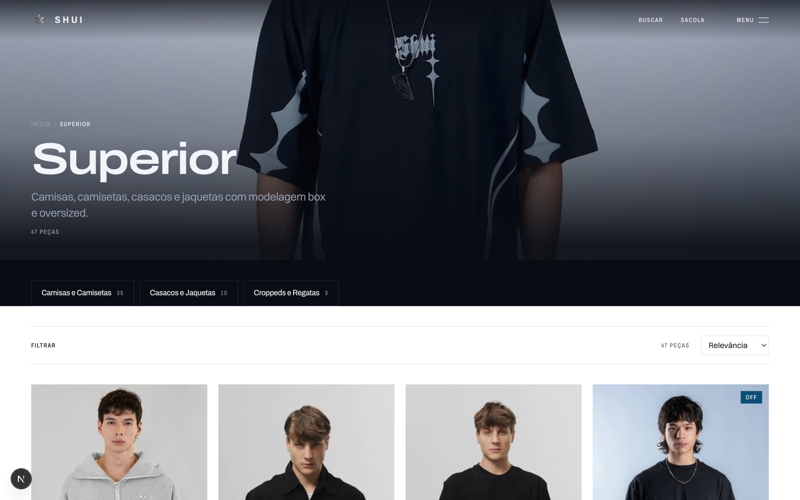
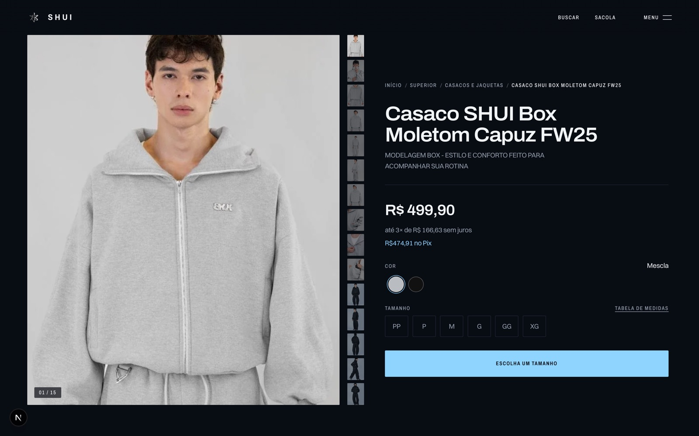
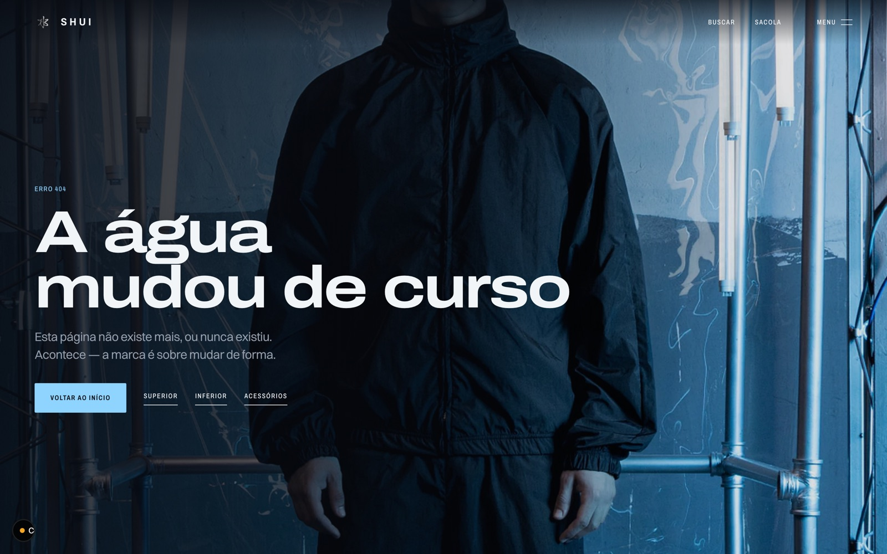

# exemplo — SHUI, um site inteiro montado a partir do acervo

Loja de streetwear em Next 16. **81 produtos, 765 variantes, 99 páginas estáticas.**
Vitrine autoral por cima do checkout da Nuvemshop, para não perder o meio de pagamento
nem o indexado.

Não foi escrita do zero. Ela é a receita **`shui-vitrine-nuvemshop`** — três peças do
acervo compostas, e cada decisão saiu de uma busca.


---

## As três peças, e o que cada uma entregou

```bash
python scripts/buscar.py "loja de roupa streetwear catalogo"
```

| Peça | Família | O que veio dela |
|---|---|---|
| **`format-archive`** | template | rotas `[slug]`, catálogo, carrinho em Zustand — a parte chata, pronta |
| **`nrmlss`** | template | a ficha de produto: hero pinado com as fotos subindo no scrub, coluna de compra parada |
| **`ds-filling-pieces`** | design-system | a identidade: monocromático, tipografia carregando a marca, foto como única cor |

O eixo que faz isso funcionar: **template dá a estrutura, design system dá a
identidade.** São independentes, então a mesma estrutura serve o próximo cliente com
outra cara, e a mesma identidade serve outra estrutura.

Aqui o `ds-filling-pieces` só precisou ser **portado**, não decidido — a SHUI já tinha
fotografia forte e identidade fechada. É o caso em que o acervo economiza mais.

---

## O que saiu

| | |
|---|---|
|  |  |
| **Categoria** — 47 peças, facetas por cor e tamanho, ordenação | **Ficha** — galeria de 15 fotos, cor, tamanho, parcelamento, Pix |



**Busca** com filtro ao vivo sobre os 81 produtos. O acervo não tinha peça de busca
para moda; esta foi construída e **voltou para o acervo** depois.

---

## Os quatro bugs que a montagem encontrou

Nenhum destes dá erro. Todos passam no build, sobem em produção e só aparecem quando
um cliente reclama. Todos estão gravados como **armadilha** nas peças de origem — quem
escolher `format-archive` amanhã lê os quatro antes de começar.

### 1. SKU repetido entre tamanhos · `crítica`

Chavear a sacola por SKU parece óbvio e quebra em catálogo real: **17 dos 81 produtos
repetem o mesmo SKU em todos os tamanhos.** O item P e o GG viram uma linha só, e o
tamanho errado vai para o checkout — sem erro nenhum.

Chavear pelo **id da variante**, único nas 765. E conferir com um `Counter` antes de
assumir que SKU é único.

### 2. `opcao1` não é a cor · `crítica`

Em catálogo exportado de plataforma SaaS, a primeira opção não tem posição fixa. Nos
81 produtos da SHUI: 51 são `(Cor, Tamanho)`, 14 são só `(Tamanho)`, **6 vêm
declarados invertidos**, e num deles o próprio array de opções mente — diz
`[Tamanho, Cor]` enquanto `opcao1` guarda `Preto`.

Ler `opcao1` como cor põe "P, M, G" como bolinha de cor em **27 dos 81 produtos** e
some com o seletor de tamanho. Nem a posição nem o rótulo servem: quem decide é o
**valor**. Tamanho vem de vocabulário fechado (`PP|P|M|G|GG|XG…`); o eixo cujos valores
batem nele é o tamanho, o outro é a cor.

### 3. O prefetch que baixa doze páginas por clique · `alta`

`next/link` prefetcha toda rota que entra no viewport — numa categoria de 47 cards são
**47 páginas baixadas antes de qualquer clique**. Pior: o React 19 emite
`<link rel=preload>` para toda imagem com `fetchPriority=high`, e esse preload **viaja
dentro do payload prefetchado**. Uma página acabava puxando a capa de doze outras, e
toda página interna baixava o hero de 695 KB por causa do link "Início" da migalha.

`prefetch={false}` em card de grade e em link de volta; prioridade alta só no LCP real.

### 4. A mesma cor cadastrada de cinco jeitos · `alta`

`PRETO` e `Preto`, `Off-White` e `Off White`, `Marinho` e `Azul Marinho`. A faceta
mostrava **20 bolinhas para 16 cores reais**, com pares idênticos devolvendo listas
diferentes — e marcar "Preto" perdia todo produto cadastrado como "PRETO".

Corrigir **no dado**, no build do catálogo: chave sem acento, sem caixa, sem separador.
E um mapa nome→hex de fallback, porque 22 cores vêm sem valor no cadastro e a bolinha
renderiza transparente.

---

## O ciclo, que é o ponto

```
buscar → montar → tropeçar → registrar → a próxima montagem já sabe
```

A SHUI não consumiu o acervo, ela **o pagou de volta**: saiu com quatro armadilhas
novas nas peças de origem e a receita `shui-vitrine-nuvemshop` gravada, pronta para a
próxima loja que rodar em plataforma fechada.

```bash
python scripts/buscar.py "vitrine sobre checkout de plataforma"
python scripts/buscar.py "format-archive" | grep ARMADILHA
```

> **Por que não tem código aqui.** O que faz este exemplo valer é o *processo*, e o
> código é de terceiros — os dois templates vêm do acervo pessoal e a loja é de um
> cliente real. O plugin distribui o motor; o material continua sendo de quem é.
> Para um exemplo **rodável**, as três peças que vêm em [`seed/`](../seed/) montam uma
> página completa sem depender de acervo nenhum.
