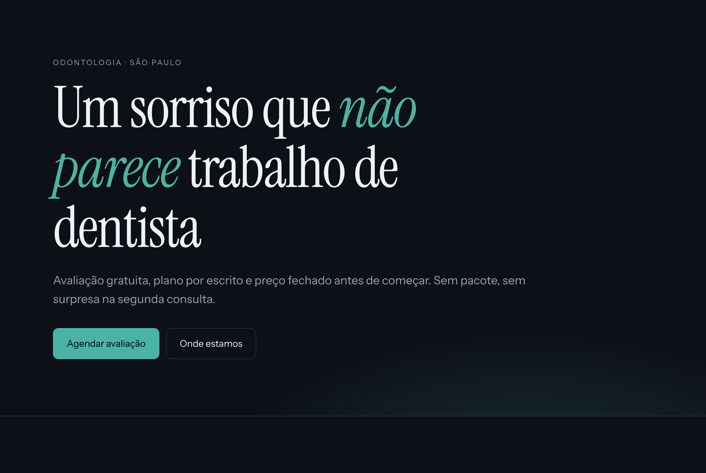

# exemplo — o que o cannonball entrega numa instalação limpa

[`clinica-vertice/`](clinica-vertice/) é uma landing page de clínica odontológica
montada **inteiramente com as três peças que vêm na instalação** — `kit-agendamento`,
`kit-calendario` e `kit-mapa` — mais código escrito na hora.

Nenhuma peça de acervo particular entrou aqui. É reproduzível por quem clonar hoje.

```bash
cd clinica-vertice && npm install && npm run dev
```



---

## O ponto: nada foi escolhido no olho

Cada decisão saiu de um comando, e o comando está registrado.

**A paleta** veio de `scripts/cor.py`, que deriva 11 papéis a partir de três decisões
(fundo, tinta, acento) e mede WCAG em cada par que existe na tela:

```
$ python scripts/cor.py --paleta --fundo "#0d1117" --tinta "#eef2f5" --acento "#4bb3a5"

   16.81:1  AAA   texto principal sobre o fundo
    7.45:1  AAA   texto secundário sobre o fundo
    7.47:1  AAA   acento como controle
    8.29:1  AAA   texto DENTRO do botão de acento
    3.53:1  AA    legenda — só passa em texto grande
```

Aquele `3.53:1` mudou o CSS: `--fg-apagado` **não** é usado em rótulo de 13,6px. Sem
medir, seria.

**A tipografia** veio de `scripts/tipo.py`. Instrument Serif no display e Instrument
Sans no corpo, escolhidas por `--par` (casam por desenho) e as duas Google Fonts —
`--licenca` existe justamente porque a fonte bonita costuma ser a que não se pode
servir. A escala é `--escala --base 17 --razao 1.25`, copiada direto para os tokens.

**O hero** é o passo 2.2 da `kit-montar`: perguntar o tipo antes de construir. Sem
material do cliente, sobraram os dois tipos que não dependem de nada — tipográfico e
WebGL. Escolhido o tipográfico: nada para carregar, nada para expirar, e nenhuma
máquina em que ele deixe de renderizar.

---

## As quatro armadilhas que este exemplo pagou

Este exemplo não é uma vitrine — é o teste que encontrou defeito. Todas as quatro
foram gravadas no acervo com `scripts/armadilhas.py`, e agora saem impressas na busca
para quem escolher `kit-agendamento` amanhã.

### 1. Import escrito para o layout errado · `alta`

O `kit-agendamento` importava `../../kit-calendario/codigo/Calendario` — caminho que
só resolve **dentro do acervo**. O README manda copiar para `components/kit-<nome>/`,
onde `../../` passa do alvo e o segmento `/codigo/` não existe.

O build quebra com `Module not found`, que parece falta de dependência e é falta de
caminho. **Corrigido na peça**, não só aqui.

### 2. `1.5h` para noventa minutos · `media`

O formatador padrão arredonda para uma casa decimal: 75min vira `1.3h`. Ninguém lê
"1.3h" como uma hora e quinze, e em pt-BR hora quebrada não usa ponto decimal.

A ficha já avisava e diz onde consertar — na prop `textos`, sem tocar no componente:

```tsx
duracao: (min) =>
  min < 60 ? `${min}min`
  : min % 60 === 0 ? `${min / 60}h`
  : `${Math.floor(min / 60)}h${String(min % 60).padStart(2, "0")}`
```

### 3. A ponte de contraste precisa alcançar o calendário · `alta`

O calendário **redeclara** `--kit-fg-suave` dentro do próprio bloco, e declaração
local vence herança. Ajustar só no contêiner do agendamento não chega lá.

Medido no navegador, nesta paleta:

| | iniciais dos dias da semana |
|---|---|
| ponte alcançando `.kit-cal` | **7,33:1** — AAA |
| só a declaração local | **3,11:1** — reprova AA |

2,4× de diferença, e **nada avisa**. Por isso o CSS traz os dois seletores:

```css
.secao-agendamento,
.secao-agendamento .kit-cal { --kit-fg-suave: …; --kit-fg-apagado: …; }
```

### 4. Seletor de elemento vazando para dentro da peça · `media` — nova

Esta apareceu montando, e é do **site**, não da peça: um `section { padding-block: 8rem }`
solto alcança o `<section>` interno do componente e injeta 128px no meio do painel.
Abre um buraco que parece defeito da peça.

Peça copiada traz a marcação dela junto, e nenhum seletor de elemento sabe disso.

```css
main > section, main > header { padding-block: … }   /* escopado ao nível de página */
```

### E uma que não virou armadilha, virou correção

O esqueleto que segura o layout enquanto o componente monta estava com `34rem`,
enquanto o componente montado mede 495px. A página pulava 49px — metade do motivo de
o esqueleto existir. Agora é `31rem`, **medido no navegador**, não estimado.

---

## O ciclo, inteiro, num exemplo só

```
buscar → montar → tropeçar → registrar → a próxima pessoa não tropeça
```

As três peças chegaram com 11 armadilhas. Saíram deste exemplo com **13**. É isso que
o cannonball faz: cada projeto deixa o acervo mais esperto que ele estava antes.

```bash
python scripts/buscar.py "agendamento" | grep ARMADILHA
```

---

## Estrutura

```
clinica-vertice/
  app/
    globals.css        tokens medidos + as duas correções de armadilha
    layout.tsx         as fontes, com o porquê da escolha
    page.tsx           hero tipográfico + serviços
    api/agendar/       para onde a marcação vai (aqui, um eco)
  components/
    kit-agendamento/   ┐
    kit-calendario/    ├ copiadas do acervo, sem alteração além do import
    kit-mapa/          ┘
    site/              o que é deste cliente e não se reaproveita
```

A separação é a regra: **peça do acervo não se edita para atender um cliente.** Tudo
que muda de cliente para cliente sai por prop ou por variável CSS. Se você precisou
abrir o `.tsx` da peça, ou o caso é novo mesmo, ou a peça está mal desenhada.
